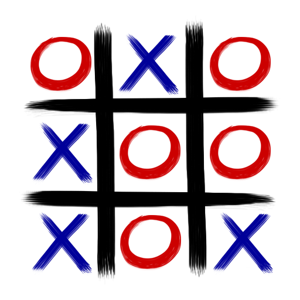

 

  <a align="left" href="https://github.com/Dhekki" target="_blank">
     <picture>
        <source media="(prefers-color-scheme: dark)"  srcset="https://img.shields.io/static/v1?label=Overview&labelColor=232F3E&message=Dhekki%20%F0%9F%87%A7%F0%9F%87%B7&color=003DA5&style=for-the-badge&logo=GitHub">
        <source media="(prefers-color-scheme: light)" srcset="https://img.shields.io/static/v1?label=Overview&labelColor=38BDAE&message=Dhekki%20%F0%9F%87%A7%F0%9F%87%B7&color=628EDA&style=for-the-badge&logo=GitHub">
        
     </picture>
  </a>
  

  
  I am a Computer Science Student, <strong>AWS</strong> Certified and a Winner of the <strong>10th Cisco Brazil CyberEducation Marathon</strong>.
    
  I have a great interest in Linux (I use Arch, btw), terminal automation, cybersecurity, cloud computing, and machine learning!

  💻 <strong>Languages: </strong>  
 <picture>
    <source media="(prefers-color-scheme: dark)"  srcset="https://img.shields.io/badge/Python-232F3E?style=for-the-badge&logo=python">
    <source media="(prefers-color-scheme: light)" srcset="https://img.shields.io/badge/Python-38BDAE?style=for-the-badge&logo=python">
    
  </picture><picture>
    <source media="(prefers-color-scheme: dark)"  srcset="https://img.shields.io/badge/JavaScript-232F3E?style=for-the-badge&logo=javascript">
    <source media="(prefers-color-scheme: light)" srcset="https://img.shields.io/badge/JavaScript-38BDAE?style=for-the-badge&logo=javascript">
    
  </picture><picture>
    <source media="(prefers-color-scheme: dark)"  srcset="https://img.shields.io/badge/Java-232F3E?style=for-the-badge&logo=OpenJDK">
    <source media="(prefers-color-scheme: light)" srcset="https://img.shields.io/badge/Java-38BDAE?style=for-the-badge&logo=OpenJDK">
    
  </picture><picture>
    <source media="(prefers-color-scheme: dark)"  srcset="https://img.shields.io/badge/c-232F3E?style=for-the-badge&logo=c&logoColor=white">
    <source media="(prefers-color-scheme: light)" srcset="https://img.shields.io/badge/c-38BDAE?style=for-the-badge&logo=c&logoColor=white">
    
  </picture><picture>
    <source media="(prefers-color-scheme: dark)"  srcset="https://img.shields.io/badge/C%2B%2B-232F3E?style=for-the-badge&logo=c%2B%2B">
    <source media="(prefers-color-scheme: light)" srcset="https://img.shields.io/badge/C%2B%2B-38BDAE?style=for-the-badge&logo=c%2B%2B">
    
  </picture><picture>
    <source media="(prefers-color-scheme: dark)"  srcset="https://img.shields.io/badge/GML-232F3E?logo=gamemaker&style=for-the-badge">
    <source media="(prefers-color-scheme: light)" srcset="https://img.shields.io/badge/GML-38BDAE?logo=gamemaker&style=for-the-badge">
    
  </picture>

  🛠️ <strong>Tools:</strong>  
  <picture>
    <source media="(prefers-color-scheme: dark)"  srcset="https://img.shields.io/badge/Arch%20Linux-232F3E?style=for-the-badge&logo=ArchLinux">
    <source media="(prefers-color-scheme: light)" srcset="https://img.shields.io/badge/Arch%20Linux-38BDAE?style=for-the-badge&logo=ArchLinux">
    
  </picture><picture>
    <source media="(prefers-color-scheme: dark)"  srcset="https://img.shields.io/badge/Hyprland-232F3E?style=for-the-badge&logo=Hyprland">
    <source media="(prefers-color-scheme: light)" srcset="https://img.shields.io/badge/Hyprland-38BDAE?style=for-the-badge&logo=Hyprland">
    
  </picture><picture>
    <source media="(prefers-color-scheme: dark)"  srcset="https://img.shields.io/badge/Packet Tracer-232F3E?style=for-the-badge&logo=cisco">
    <source media="(prefers-color-scheme: light)" srcset="https://img.shields.io/badge/Packet Tracer-38BDAE?style=for-the-badge&logo=cisco">
    
  </picture><picture>
    <source media="(prefers-color-scheme: dark)"  srcset="https://img.shields.io/badge/Docker-232F3E?style=for-the-badge&logo=docker">
    <source media="(prefers-color-scheme: light)" srcset="https://img.shields.io/badge/Docker-38BDAE?style=for-the-badge&logo=docker">
    
  </picture><picture>
    <source media="(prefers-color-scheme: dark)"  srcset="https://img.shields.io/badge/Git-232F3E?style=for-the-badge&logo=git">
    <source media="(prefers-color-scheme: light)" srcset="https://img.shields.io/badge/Git-38BDAE?style=for-the-badge&logo=git">
    
  </picture><picture>
    <source media="(prefers-color-scheme: dark)"  srcset="https://img.shields.io/badge/Postman-232F3E?style=for-the-badge&logo=postman">
    <source media="(prefers-color-scheme: light)" srcset="https://img.shields.io/badge/Postman-38BDAE?style=for-the-badge&logo=postman">
    
  </picture><picture>
    <source media="(prefers-color-scheme: dark)"  srcset="https://img.shields.io/badge/Neovim-232F3E?style=for-the-badge&logo=neovim">
    <source media="(prefers-color-scheme: light)" srcset="https://img.shields.io/badge/Neovim-38BDAE?style=for-the-badge&logo=neovim">
    
  </picture><picture>
    <source media="(prefers-color-scheme: dark)"  srcset="https://img.shields.io/badge/Game Maker-232F3E?style=for-the-badge&logo=gamemaker">
    <source media="(prefers-color-scheme: light)" srcset="https://img.shields.io/badge/Game Maker-38BDAE?style=for-the-badge&logo=gamemaker">
    
  </picture><picture>
    <source media="(prefers-color-scheme: dark)"  srcset="https://img.shields.io/badge/Arduino-232F3E?style=for-the-badge&logo=Arduino">
    <source media="(prefers-color-scheme: light)" srcset="https://img.shields.io/badge/Arduino-38BDAE?style=for-the-badge&logo=Arduino">
    
  </picture><picture>
    <source media="(prefers-color-scheme: dark)"  srcset="https://img.shields.io/badge/AWS-232F3E?style=for-the-badge">
    <source media="(prefers-color-scheme: light)" srcset="https://img.shields.io/badge/AWS-38BDAE?style=for-the-badge">
    
  </picture>

  🔗 <strong>Social Links:</strong>  
  <a href="mailto:gmdo0420@gmail.com" title="Gmail"><picture>
    <source media="(prefers-color-scheme: dark)" srcset="https://img.shields.io/badge/Gmail-232F3E?logo=gmail&style=for-the-badge">
    <source media="(prefers-color-scheme: light)" srcset="https://img.shields.io/badge/Gmail-38BDAE?logo=gmail&style=for-the-badge">
    </picture></a>
  <a href="https://www.linkedin.com/in/dhekki/" title="LinkedIn"><picture>
    <source media="(prefers-color-scheme: dark)" srcset="https://custom-icon-badges.demolab.com/badge/LinkedIn-232F3E?logo=linkedin-white&logoColor=fff&style=for-the-badge">
    <source media="(prefers-color-scheme: light)" srcset="https://custom-icon-badges.demolab.com/badge/LinkedIn-38BDAE?logo=linkedin-white&logoColor=fff&style=for-the-badge">
    </picture></a>
  <a href="https://www.instagram.com/gmo0420/" title="Instagram"><picture>
    <source media="(prefers-color-scheme: dark)" srcset="https://img.shields.io/badge/Instagram-232F3E?logo=instagram&style=for-the-badge">
    <source media="(prefers-color-scheme: light)" srcset="https://img.shields.io/badge/Instagram-38BDAE?logo=instagram&style=for-the-badge">
    </picture></a>
  <a href="https://x.com/Dhekkii" title="Twitter"><picture>
    <source media="(prefers-color-scheme: dark)"  srcset="https://img.shields.io/badge/Twitter-232F3E?logo=X&style=for-the-badge">
    <source media="(prefers-color-scheme: light)" srcset="https://img.shields.io/badge/Twitter-38BDAE?logo=X&style=for-the-badge">
    </picture></a>

---

### 🚀 Featured Projects

 

**&nbsp;&nbsp;&nbsp;Cantina Vidal - Retail Management Platform** \
&nbsp;&nbsp;&nbsp;Fullstack Web Application • 2025 \
&nbsp;&nbsp;&nbsp;Role: Backend Lead & Software Architect \
&nbsp;&nbsp;&nbsp;Languages & Technologies:
<picture>
    <source media="(prefers-color-scheme: dark)"  srcset="https://img.shields.io/badge/-Java-232F3E?&logo=openJDK">
    <source media="(prefers-color-scheme: light)" srcset="https://img.shields.io/badge/-Java-38BDAE?&logo=openJDK">
    
  </picture>
  <picture>
    <source media="(prefers-color-scheme: dark)"  srcset="https://img.shields.io/badge/-SpringBoot-232F3E?&logo=springboot">
    <source media="(prefers-color-scheme: light)" srcset="https://img.shields.io/badge/-SpringBoot-38BDAE?&logo=springboot">
    
  </picture>
  <picture>
    <source media="(prefers-color-scheme: dark)"  srcset="https://img.shields.io/badge/-Docker-232F3E?&logo=Docker">
    <source media="(prefers-color-scheme: light)" srcset="https://img.shields.io/badge/-Docker-38BDAE?&logo=Docker">
    
  </picture>
  <picture>
    <source media="(prefers-color-scheme: dark)"  srcset="https://img.shields.io/badge/-Actions-232F3E?&logo=githubactions">
    <source media="(prefers-color-scheme: light)" srcset="https://img.shields.io/badge/-Actions-38BDAE?&logo=githubactions">
    
  </picture>
     

> A high-concurrency order management system designed to eliminate bottlenecks and queues. Features a robust Java API with Server-Sent Events (SSE) for real-time, zero-polling kitchen synchronization.
> *Technical Highlights:* Built with Java 21 and Spring Boot, implementing strict RBAC, Argon2 hashing, QueryDSL type-safety, real soft-deletes (`@SQLDelete`), and automated CI/CD Docker deployments.
  

 

 

**&nbsp;&nbsp;&nbsp;Traffic Light Detection & Classification** \
&nbsp;&nbsp;&nbsp;Computer Vision PoC • 2026 \
&nbsp;&nbsp;&nbsp;Role: Solo Developer / Researcher \
&nbsp;&nbsp;&nbsp;Languages & Technologies:
<picture>
    <source media="(prefers-color-scheme: dark)"  srcset="https://img.shields.io/badge/-Python-232F3E?&logo=Python">
    <source media="(prefers-color-scheme: light)" srcset="https://img.shields.io/badge/-Python-38BDAE?&logo=Python">
    
  </picture>
  <picture>
    <source media="(prefers-color-scheme: dark)"  srcset="https://img.shields.io/badge/-OpenCV-232F3E?&logo=opencv">
    <source media="(prefers-color-scheme: light)" srcset="https://img.shields.io/badge/-OpenCV-38BDAE?&logo=opencv">
    
  </picture>
    

> A Two-Stage Computer Vision Proof of Concept (PoC) for real-world traffic light state classification.
> *Technical Highlights:* Applies SOLID principles by decoupling YOLOv8 Object Detection (ROI extraction) from a custom OpenCV Spatial Heuristic algorithm, overcoming traditional pixel-color fragility under glare or cloudy conditions.
  

 

 

**&nbsp;&nbsp;&nbsp;Minimax Tic-Tac-Toe Agent** \
&nbsp;&nbsp;&nbsp;Artificial Intelligence & Game Theory • 2026 \
&nbsp;&nbsp;&nbsp;Role: Solo Developer \
&nbsp;&nbsp;&nbsp;Languages & Technologies:
<picture>
    <source media="(prefers-color-scheme: dark)"  srcset="https://img.shields.io/badge/-Java-232F3E?&logo=openJDK">
    <source media="(prefers-color-scheme: light)" srcset="https://img.shields.io/badge/-Java-38BDAE?&logo=openJDK">
    
  </picture>
  <picture>
    <source media="(prefers-color-scheme: dark)"  srcset="https://img.shields.io/badge/-Docker-232F3E?&logo=Docker">
    <source media="(prefers-color-scheme: light)" srcset="https://img.shields.io/badge/-Docker-38BDAE?&logo=Docker">
    
  </picture>
    

> An invincible console-based game agent built to deeply explore Artificial Intelligence and Game Theory fundamentals.
> *Technical Highlights:* Implements a recursive decision tree using the Minimax algorithm, heavily optimized with Alpha-Beta Pruning to evaluate states, prioritize faster winning paths, and execute flawless logic.
  

### Badges

  
  
  
  
  
  </a>

<picture>
    <source media="(prefers-color-scheme: dark)"  srcset="https://github-stats-extended.vercel.app/api/top-langs/?username=dhekki&exclude_repo=RhythmGml&layout=donut&theme=tokyonight&hide_border=true">
    <source media="(prefers-color-scheme: light)" srcset="https://github-stats-extended.vercel.app/api/top-langs/?username=dhekki&exclude_repo=RhythmGml&layout=donut&hide_border=true">
    
</picture>&nbsp;
<picture>
    <source media="(prefers-color-scheme: dark)"  srcset="https://github-stats-extended.vercel.app/api?username=dhekki&show_icons=true&theme=tokyonight&rank_icon=github&hide_border=true">
    <source media="(prefers-color-scheme: light)" srcset="https://github-stats-extended.vercel.app/api?username=dhekki&show_icons=true&rank_icon=github&hide_border=true">
       
</picture>

 

  <picture>
    <source media="(prefers-color-scheme: dark)"  srcset="assets/icon.gif">
    <source media="(prefers-color-scheme: light)" srcset="https://media1.tenor.com/m/rHkV1rnt4asAAAAd/komi-komi-san.gif">
       
  </picture>&nbsp;
    
  <em align="left"><b> You can't control the wind  but you can adjust your sails. It's not about what happens to you, it's how you react...</b></em>
     
   

     

